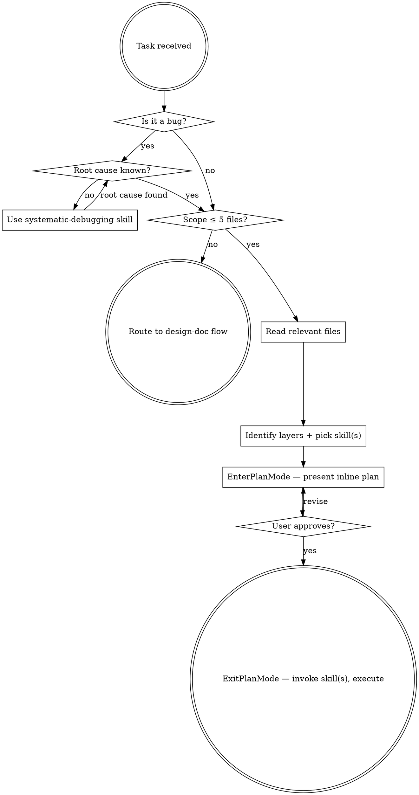

# Task Analyst

Lightweight analysis gate for bugs and small tasks. Prevents jumping straight to code while avoiding design-doc overhead.

<HARD-GATE>
Do NOT write code or invoke any implementation skill until you have completed the analysis and the user has approved the plan via plan-mode.
After reading relevant files and identifying layers, call `EnterPlanMode` to present the inline plan. Only call `ExitPlanMode` once the user approves. Then route to the correct skill(s).
</HARD-GATE>

## When to Use

- Bugfixes with known or suspected root cause
- Small additions (single endpoint, component, config change)
- Refactors or cross-stack fixes with clear scope (up to ~5 files)

**Not this skill:** Unknown root cause → use `/systematic-debugging` first, then return here. Multiple subsystems or unclear scope → `/design-doc` → `/design-plan`. Architecture decision → `/system-architect`.

## Process

### Layer → Skill Routing

| Layer | Skill |
|-------|-------|
| Bug with unknown root cause | `/systematic-debugging` first, then return here |
| Backend only (.NET / ASP.NET Core / EF Core) | `/backend-engineer` |
| Frontend only (React / TypeScript) | `/frontend-engineer` |
| Cross-stack | Agree the API contract in the plan first, then `/backend-engineer` → `/frontend-engineer` |
| Multiple subsystems / unclear scope | `/design-doc` → `/design-plan` |
| Architecture decision | `/system-architect` |

### Inline Plan Template

> **Problem:** One sentence — what's broken or missing.
> **Root cause / Rationale:** What needs to change and why.
> **Changes:** `backend/Dashy.Api/Application/Services/SomeService.cs` — description (one line each)
> **Skill(s):** e.g. `/backend-engineer` → `/frontend-engineer`
> **Risk:** Low/Medium — anything non-obvious (migration needed, SSE/polling behaviour, cache invalidation).

5-15 lines. Past 15 → probably needs a design doc.

## Red Flags

| Thought | Reality |
|---------|---------|
| "Too simple to analyze" | 2 min of analysis prevents 20 min of rework. |
| "I already know the fix" | You know *a* fix, not *the right* fix. Use `/systematic-debugging`. |
| "A plan is gold-plating" | 5 lines isn't gold-plating. Skipping analysis is gambling. |
| "Let me just read and fix" | Reading is step 1. Fixing is step 3. Don't merge them. |
| "No skill needed" | The skill routes you correctly — that's the value. |
